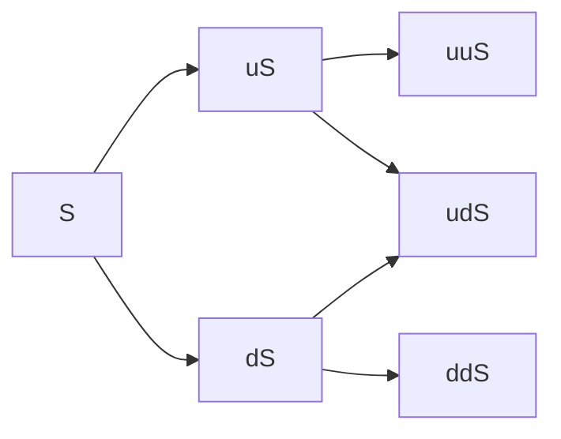

# Financial Computing 2020 Spring HW2

**b06902074 柯宏穎**

### Introduction

&emsp; To compute the put prices of Bermuda options. We can use binomial tree to find it.



&emsp; After construct the tree and find the spot price at any period, we can compute the put option by backward algorithm. And Bermuda options can only be exercised at specific dates. So we need to check it additionally.


### How to run

&emsp; I use $python3$ to accomplish this assignment.

```powershell
pip3 install -r requirement.txt
python3 hw2.py (then input the parameter as same as the example)
```

&emsp; Example:

```powershell
python3 hw1.py
100 110 3 30 60 10 20 30 40 50 5
```

&emsp; Output:

```powershell
11.24813935053309
```

